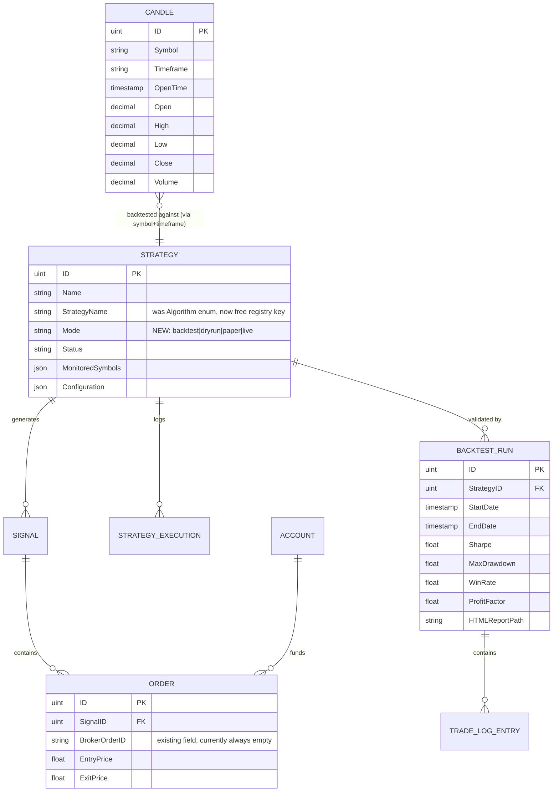

# go-trade-bot — Refactoring Blueprint

**Source PRD**: `docs/prd/refactoring.md` (v1.0, August 2026)
**Status**: Planning deliverable — no application code changed by this document.
**Audience**: Demitrius (solo maintainer), future contributors.

---

## 1. Executive Summary

The PRD's critical finding is verified against the actual code, not assumed: **go-trade-bot is a paper-trading
simulator wearing a live-trading bot's clothes.** `SignalUseCase.GenerateBuySignal` /
`GenerateSellSignal` (`app/usecase/signal/usecase.go:58-137`) write only to Postgres via GORM and mutate an
`Account.Amount` float — there is no `NewCreateOrderService` call anywhere in the repository (confirmed by
search), and `internal/broker/broker.go:12-55` exposes exactly three read-only methods
(`ListTickerPrices`, `ListKline`, `Get24hVolume`). All three shipped strategy configs in
`docs/strategy-examples/*.json` carry `"status": "testing"`.

Beyond the headline finding, three structural problems compound the gap between current and target state:

1. **No abstraction boundary anywhere.** `app/services/algorithm/{grid,scalping,bollinger}/algorithm.go` each
   import `internal/broker` (the concrete struct, not an interface) and `github.com/markcheno/go-talib`
   directly, and each **redeclare an identical `SignalUseCase` interface** rather than sharing one. There is
   no ACL — the PRD's `ExchangeClient` / `IndicatorProvider` boundary does not exist in any form.
2. **Dispatch is a hardcoded switch, not a plugin system.** `app/handler/tasks/strategy/handler.go:107-119`
   switches on `entities.Algorithm` (a 3-value string enum defined in `app/entities/strategy.go:9-15`) to
   construct one of three concrete processor structs. Adding a fourth strategy means editing this handler,
   the entity enum, and `IsValidAlgorithm`.
3. **The "cycle" is REST polling with a delay, not an event-driven feed.** `app/workers/strategy/strategy.go`
   re-enqueues the same asynq task with `asynq.ProcessIn(cycle * time.Minute)` after every execution. There
   is no `Feed` interface, no candle storage, no WebSocket client, and no backtest engine of any kind — Phase
   2 of the PRD is a 100% greenfield build.

The TUI (`cmd/console/`) has real bones — a `Page` interface (`cmd/console/pages/master.go:10-15`) with
`Set/Render/StopSync/StartSync` — but only 3 of the PRD's 6 pages exist (Status, Performance, Open Orders),
none use braille sparklines, and the console uses a hand-rolled `dependencies.Dependencies` struct
(`cmd/console/dependencies/dependencies.go`) instead of the `uber/fx` DI pattern used by `cmd/api` and
`cmd/worker` — a divergence the roadmap should not paper over.

`go.mod` confirms the library gaps: `cinar/indicator/v2`, `gonum.org/v1/gonum`, gRPC, and `bubbletea` are
**not** dependencies today. `go-talib`, `go-binance/v2`, `termui/v3`, and `asynq` already are.

**Bottom line**: this is not a refactor of working live-trading code — it is a **new live-trading core, a new
plugin architecture, and a new research subsystem**, built adjacent to a currently-correct paper-trading data
model (`Signal`/`Order`/`Account` in `app/entities/`) that must be extended, not replaced, to support real
exchange order IDs and execution modes.

A fourth, previously-unscoped finding surfaced during this audit: the existing Prometheus/Grafana stack is
**partially blind today**. `cmd/worker/main.go:79-97` never mounts a `/metrics` HTTP handler on the worker's
`:9191` server — only the Asynqmon UI is served there — yet `prometheus.yml` has scraped that exact
`go-worker` target from day one. Every worker-side metric registered via `internal/metrics/collector.go`
(`total_strategy_task`, `asyn_total_task_execution`, `asynq_total_task_duration`) has been invisible to
Prometheus this whole time. This must be fixed in Phase 1 regardless of the PRD, since Phase 1 adds the
metrics that matter most for live-trading safety (order latency, WS reconnects) — see §7.

---

## 2. Gap Analysis

Each area: **Current State** (with file:line) → **Target State** (PRD §4/§5) → **Gap**.

### 2.1 Live Trading Core

| | Detail |
|---|---|
| **Current** | `internal/broker/broker.go:12-55` — `Broker` struct wraps `*binance.Client` directly, exposes `ListTickerPrices`, `ListKline`, `Get24hVolume`. No `PlaceOrder`, `CancelOrder`, `GetAccountBalance`, or `SubscribeKline`. `app/usecase/signal/usecase.go:40-42` even declares its own narrow `Broker` interface returning `[]*binance.SymbolPrice` — a **go-binance type leaking into the usecase layer**, the opposite of an ACL. Stop-loss is polled in `algorithm.go` `monitore`/`generateSell` functions (e.g. `grid/algorithm.go:84-112`) by comparing live ticker price to `entryPrice * (1 - stopLossPct)` every cycle — if the worker process is down when price crosses the threshold, the stop never fires. |
| **Target** | `ExchangeClient` ACL interface (PRD §5) with `PlaceOrder`, `CancelOrder`, `ListKline`, `ListTickerPrices`, `GetAccountBalance`, `SubscribeKline`. Stop-loss submitted as a real `STOP_MARKET` order at position-open time. `LiveFeed` streams candles via Binance WebSocket. Generic webhook notifier on trade events. |
| **Gap** | 100% net-new: no order placement, no ACL interface, no WebSocket client, no notifier. The existing `Broker` becomes the seed for a `BinanceAdapter` implementing the new interface — it is not thrown away, but its call sites (all of `app/services/algorithm/*`) currently depend on its concrete type and must be re-pointed at the interface. |

### 2.2 Strategy Plugin System

| | Detail |
|---|---|
| **Current** | `app/entities/strategy.go:9-15,69-76` — `Algorithm` is a closed string enum (`grid`/`scalping`/`bollinger`) validated by `IsValidAlgorithm`. `app/handler/tasks/strategy/handler.go:107-119` — `processStrategy` switches on this enum to build one of three concrete processor structs (`grid.NewGridProcessor`, `scalping.NewScalpingProcessor`, `bollinger.NewBollingerProcessor`), each satisfying an ad-hoc, **locally-redefined** `IStrategyProcessor` interface (`Execute() error`, `handler.go:25-27`). Each algorithm package independently redeclares the same 3-method `SignalUseCase` interface (`grid/algorithm.go:35-39`, `bollinger/algorithm.go:22-26`, `scalping/algorithm.go:23-27`) — no shared contract. State between cycles is held in `internal/memcache` keyed by string prefix (`grid/algorithm.go:15,61`), not in any typed context. |
| **Target** | `Strategy` interface with lifecycle hooks (`Name/Before/ShouldLong/GoLong/ShouldShort/GoShort/UpdatePosition/After/Terminate`), `Context` struct carrying `Candles/Position/Account/Config/Indicators/Price/Timeframe/Symbol/Mode`, `Signal{Buy,Sell,StopLoss,TakeProfit}` return type, self-registering registry via `init()`, `IndicatorProvider` ACL. |
| **Gap** | Full rewrite of the strategy layer's shape (not necessarily its trading logic). The RSI/Bollinger-band/grid-spacing math in the three existing algorithms is provably working and should be **ported line-for-line into the new hook shape**, not redesigned. The switch in `handler.go` is deleted entirely and replaced by registry lookup. `entities.Algorithm` as a closed enum is replaced by a free-form string strategy name resolved against the registry (schema/migration implication — see §5.2). |

### 2.3 Backtest Engine

| | Detail |
|---|---|
| **Current** | Nothing. `go.mod` has no `cinar/indicator/v2`, no candle table/migration in `app/entities/` or `app/repository/`, no `Feed` interface, no CLI import command. Every algorithm calls `p.broker.ListKline(...)` fresh on every cycle — there is no persisted candle history to backtest against. |
| **Target** | Postgres `candles(symbol, timeframe, open_time, ohlcv)` table, historical-import CLI, `Feed` interface with `ReplayFeed`/`LiveFeed` implementations, backtest execution engine reusing the live engine's strategy-hook loop, `MetricsProvider` ACL (Sharpe/Drawdown/WinRate/ProfitFactor), HTML report generation, walk-forward validation. |
| **Gap** | 100% net-new, and it is the **largest single unit of new code** in the whole PRD. It has a hard dependency on Phase 1's `Strategy`/`Context` interfaces being stable, since the backtest engine and the live engine must share the exact same hook-invocation loop (PRD §8: "Feed interface is the architectural linchpin"). |

### 2.4 Execution Modes

| | Detail |
|---|---|
| **Current** | No concept of mode exists. `entities.Strategy.Status` (`Productive/Testing/Disabled`, `app/entities/strategy.go:24-30`) is the closest analogue, but it's a lifecycle flag, not a risk-tier selector — "testing" strategies still run the exact same code path as "productive" ones against `internal/broker`'s real Binance REST client (there is just no order call to execute). There is no `MODE` env var, no testnet client, no `--confirm-live` flag anywhere in `cmd/` or `internal/configuration/configuration.go:10-36`. |
| **Target** | Four explicit modes (Backtest / Dry-Run / Paper / Capital Real) gating data source and order execution, enforced by a `MODE` env-var guard requiring `--confirm-live` for production trading. |
| **Gap** | Net-new `ExecutionMode` type (already specified in PRD §5 as part of `Context`), net-new guard logic in `cmd/worker/main.go` and/or a new engine entry point, and a **schema decision**: does `Mode` live on `Strategy` (persisted, changeable via TUI per PRD Page 2) or purely as a runtime flag? Recommendation in §6 (ADR-002). |

### 2.5 TUI

| | Detail |
|---|---|
| **Current** | `cmd/console/pages/master.go:10-15` defines a `Page` interface (`Set/Render/StopSync/StartSync`) already — this is good news, it's compatible with the PRD's migration-tractability requirement. Three pages exist: `status.go` (55 lines), `performance.go` (52 lines), `openorders.go` (147 lines) — roughly mapping to PRD "Dashboard" and "Open Positions" but without sparklines, braille, color-coded P&L brightness scaling, or keyboard-driven mode switching. `cmd/console/dependencies/dependencies.go` builds `*configuration.Configuration` and `*gorm.DB` by hand — **it does not use `uber/fx`**, unlike `cmd/api` and `cmd/worker`. Worse than a DI-style inconsistency: every rendering component reaches straight past `app/usecase` and `app/handler` into `app/repository`, instantiating repositories inline against `d.Db` — `cmd/console/components/totalizers.go:21` (`repository.NewStrategyRepository`), `account.go:17` (`repository.NewAccountRepository`), `strategylist.go:25` (`repository.NewStrategyRepository`), `cmd/console/pages/openorders.go:125` (`repository.NewSignalRepository`) — a direct violation of CLAUDE.md's own `handler → usecase → repository` layering rule. `go.mod` confirms `termui/v3` is already present; `bubbletea` is not. |
| **Target** | 6 pages (Dashboard, Strategies, Open Positions, Backtest Launcher, Backtest Results, Execution Log), braille sparklines, keyboard nav, zero flicker, mode-switching from the TUI. |
| **Gap** | The 3 existing pages and 3 of the 4 shared components are **deleted outright** (ADR-007, updated 2026-08-31), not edited — the direct-repository coupling above can't be safely patched in place, and the PRD's 6 pages don't map 1:1 onto the 3 that exist today anyway (`performance.go`'s content is absorbed into Page 2's detail panel, not carried forward as its own page). All 6 target pages are written fresh against a new `apiclient` package. Also wiring the Backtest Launcher/Results pages to a backtest engine that doesn't exist yet (hard dependency on §2.3). The `dependencies.Dependencies` vs `fx.Module` divergence (ADR-004) is revisited at the same time, since this replacement already touches every file ADR-004 was deferring on. |

---

## 3. Target Architecture

### 3.1 Core Interfaces (from PRD §5, unmodified — these are load-bearing and should not be redesigned during implementation)

```go
// app/strategies/interface.go
type Strategy interface {
    Name() string
    Before(ctx Context)
    ShouldLong(ctx Context) bool
    GoLong(ctx Context) Signal
    ShouldShort(ctx Context) bool
    GoShort(ctx Context) Signal
    UpdatePosition(ctx Context) *Signal
    After(ctx Context)
    Terminate(ctx Context)
}

type Context struct {
    Candles    []Candle
    Position   *Position
    Account    Account
    Config     map[string]interface{}
    Indicators IndicatorProvider
    Price      float64
    Timeframe  string
    Symbol     string
    Mode       ExecutionMode
}

type Signal struct {
    Buy, Sell, StopLoss, TakeProfit *Order
}

// internal/indicators/interface.go — ACL
type IndicatorProvider interface {
    RSI(candles []Candle, period int) []float64
    BollingerBands(candles []Candle, period int, stdDev float64) (upper, mid, lower []float64)
    EMA(candles []Candle, period int) []float64
    SMA(candles []Candle, period int) []float64
    MACD(candles []Candle, fastPeriod, slowPeriod, signalPeriod int) (macd, signal, hist []float64)
    ATR(candles []Candle, period int) []float64
}

// internal/exchange/interface.go — ACL
type ExchangeClient interface {
    PlaceOrder(ctx context.Context, order PlaceOrderRequest) (OrderResult, error)
    CancelOrder(ctx context.Context, symbol, orderID string) error
    ListKline(ctx context.Context, symbol, interval string, limit int) ([]Candle, error)
    ListTickerPrices(ctx context.Context, symbol string) ([]TickerPrice, error)
    GetAccountBalance(ctx context.Context) (AccountBalance, error)
    SubscribeKline(ctx context.Context, symbol, interval string) (<-chan Candle, error)
}

// internal/feed/interface.go — the linchpin (PRD §8)
type Feed interface {
    Next() (Candle, bool)
}
// ReplayFeed (Postgres-backed) and LiveFeed (WebSocket-backed) both implement this.
```

### 3.2 Target Directory Tree

Legend: `[NEW]` net-new package/file · `[MOD]` existing file modified in place · `[DEL]` deleted ·
`[KEEP]` existing file retained, logic unchanged or nearly so.

```
go-trade-bot/
├── cmd/
│   ├── api/
│   │   ├── main.go                              [MOD] wire new modules (exchange, feed, notifier)
│   │   └── modules/
│   │       ├── broker.go                        [DEL] replaced by exchange.go
│   │       ├── exchange.go                      [NEW] fx.Module providing ExchangeClient (BinanceAdapter)
│   │       ├── notifier.go                      [NEW] fx.Module providing webhook Notifier
│   │       └── ... (account/configuration/db/metrics/signal/strategy)      [KEEP]
│   ├── worker/
│   │   ├── main.go                              [MOD] MODE guard, engine wiring, feed selection,
│   │   │                                              mount /metrics (fixes pre-existing gap, see §7.1)
│   │   └── modules/
│   │       ├── broker.go                        [DEL]
│   │       ├── exchange.go                      [NEW]
│   │       ├── indicators.go                    [NEW] fx.Module providing IndicatorProvider
│   │       ├── feed.go                          [NEW] fx.Module providing Feed (Live/Replay by MODE)
│   │       ├── notifier.go                      [NEW]
│   │       ├── metrics.go                       [MOD] add order/WS/feed/backtest metric configs (§7.2)
│   │       └── ... (cache/configuration/db/signal/strategy/account)        [KEEP]
│   ├── console/                                 (Phase 3: experience fully replaced, not edited in place — ADR-007)
│   │   ├── main.go                              [MOD]
│   │   ├── apiclient/client.go                  [NEW] sole data-access path for console, read+write (ADR-007)
│   │   ├── dependencies/dependencies.go         [MOD] drops *gorm.DB, becomes {Cfg, *apiclient.Client}
│   │   ├── components/
│   │   │   ├── sparkline.go                     [NEW] braille sparkline widget wrapper
│   │   │   ├── accountsummary.go                [NEW] replaces account.go (below) — apiclient-backed
│   │   │   ├── strategytable.go                 [NEW] replaces strategylist.go + totalizers.go (below) — apiclient-backed
│   │   │   ├── strategylist.go                  [DEL] instantiated repository.NewStrategyRepository(d.Db) directly
│   │   │   ├── account.go                       [DEL] instantiated repository.NewAccountRepository(d.Db) directly
│   │   │   ├── totalizers.go                    [DEL] instantiated repository.NewStrategyRepository(d.Db) directly
│   │   │   └── error.go                         [KEEP]
│   │   └── pages/
│   │       ├── master.go                        [MOD] register 6 tabs instead of 3, pointing at the [NEW] pages below
│   │       ├── dashboard.go                     [NEW] Page 1 — replaces status.go, apiclient-backed, adds sparklines
│   │       ├── strategies.go                    [NEW] Page 2 — management + detail overlay (absorbs performance.go's data)
│   │       ├── positions.go                     [NEW] Page 3 — replaces openorders.go, apiclient-backed, live P&L coloring
│   │       ├── backtestlauncher.go              [NEW] Page 4
│   │       ├── backtestresults.go               [NEW] Page 5
│   │       ├── executionlog.go                  [NEW] Page 6
│   │       ├── status.go                        [DEL] instantiated no repo directly but superseded by dashboard.go
│   │       ├── performance.go                   [DEL] functionality absorbed into strategies.go's detail panel
│   │       └── openorders.go                    [DEL] instantiated repository.NewSignalRepository(d.Db) directly
│   ├── backtest/                                [NEW] standalone CLI: `go run cmd/backtest/main.go`
│   │   └── main.go                              [NEW] runs backtest engine headless, writes HTML report
│   └── candleimport/                            [NEW] standalone CLI: historical candle importer
│       └── main.go                              [NEW]
│
├── app/
│   ├── entities/
│   │   ├── strategy.go                          [MOD] Algorithm enum → free string; add Mode field
│   │   ├── signal.go                            [MOD] Order gains BrokerOrderID usage (field exists, unused)
│   │   ├── candle.go                            [NEW] GORM entity for candles table
│   │   ├── position.go                          [NEW] open-position read model (derived from Signal+Order)
│   │   ├── backtestrun.go                       [NEW] persisted backtest run + metrics + trade log
│   │   └── strategyperformance.go               [KEEP]
│   ├── repository/
│   │   ├── strategy/, signal/, account/         [KEEP]
│   │   ├── candle/                              [NEW] CRUD + range query for backtest/import
│   │   └── backtest/                            [NEW] persist backtest runs for TUI history list
│   ├── usecase/
│   │   ├── signal/usecase.go                    [MOD] GenerateBuySignal/GenerateSellSignal call
│   │   │                                              ExchangeClient.PlaceOrder; remove go-binance import
│   │   ├── strategy/                            [MOD] mode-switch use case (Dry-Run→Paper→Live)
│   │   ├── account/                             [KEEP]
│   │   └── backtest/                            [NEW] orchestrates engine run + metrics + report + persistence
│   ├── strategies/                              [NEW] the plugin system root
│   │   ├── interface.go                         [NEW] Strategy, Context, Signal, ExecutionMode (PRD §5)
│   │   ├── registry.go                          [NEW] map[string]StrategyFactory + Register()/Get()
│   │   ├── grid/strategy.go                     [NEW] ported from app/services/algorithm/grid
│   │   ├── bollinger/strategy.go                [NEW] ported from app/services/algorithm/bollinger
│   │   ├── scalping/strategy.go                 [NEW] ported from app/services/algorithm/scalping
│   │   └── mlgrpc/strategy.go                   [NEW, Phase 4] gRPC-delegating Strategy implementation
│   ├── services/algorithm/                      [DEL] grid/, bollinger/, scalping/ — logic moves to app/strategies/*
│   ├── engine/                                  [NEW] the single execution engine (PRD's "unified engine")
│   │   ├── engine.go                            [NEW] Feed → Strategy hook loop, mode-agnostic
│   │   ├── backtest.go                          [NEW] wraps engine.go with ReplayFeed + simulated fills
│   │   ├── dryrun.go                            [NEW] wraps engine.go with LiveFeed + simulated fills
│   │   └── metrics.go                           [NEW] Sharpe/Drawdown/WinRate/ProfitFactor (via MetricsProvider ACL)
│   ├── handler/
│   │   ├── tasks/strategy/handler.go            [MOD] delete switch; resolve via strategies.Get(name);
│   │   │                                              becomes a thin adapter feeding engine.go for LIVE mode
│   │   ├── web/strategy/                        [MOD] dto.go: add Mode field, drop closed Algorithm enum validation
│   │   ├── web/broker/handler.go                [MOD] rename package/route to exchange or keep as read-only proxy
│   │   ├── web/signal/handler.go                [KEEP]
│   │   ├── web/account/                         [KEEP]
│   │   └── web/backtest/handler.go              [NEW] trigger/poll backtest runs over REST (optional, TUI-first)
│   └── workers/strategy/strategy.go             [MOD] re-enqueue logic stays for LIVE-mode polling fallback;
│                                                       primary trigger becomes LiveFeed push, not timer replay
│
├── internal/
│   ├── broker/broker.go                         [DEL] logic absorbed into internal/exchange/binance_adapter.go
│   ├── exchange/                                [NEW] ACL boundary #1
│   │   ├── interface.go                         [NEW] ExchangeClient (PRD §5)
│   │   ├── binance_adapter.go                   [NEW] wraps go-binance; only file in repo allowed to import it
│   │   ├── binance_testnet_adapter.go           [NEW] same interface, testnet base URL (Paper Trading mode)
│   │   └── types.go                             [NEW] Candle, TickerPrice, PlaceOrderRequest, OrderResult, AccountBalance
│   ├── indicators/                              [NEW] ACL boundary #2
│   │   ├── interface.go                         [NEW] IndicatorProvider (PRD §5)
│   │   └── talib_adapter.go                     [NEW] wraps go-talib; only file allowed to import it
│   ├── feed/                                    [NEW] the architectural linchpin (PRD §8)
│   │   ├── interface.go                         [NEW] Feed { Next() (Candle, bool) }
│   │   ├── replay_feed.go                       [NEW] Postgres-backed, sequential
│   │   └── live_feed.go                         [NEW] Binance WebSocket-backed via ExchangeClient.SubscribeKline
│   ├── metrics_provider/                        [NEW, Phase 2] ACL boundary #3
│   │   ├── interface.go                         [NEW] MetricsProvider (Sharpe/Drawdown/WinRate/ProfitFactor)
│   │   └── cinar_adapter.go                     [NEW] wraps cinar/indicator/v2; only file allowed to import it
│   ├── notifier/                                [NEW] ACL boundary #4
│   │   ├── interface.go                         [NEW] NotificationSender { Send(Event) error }
│   │   └── webhook_notifier.go                  [NEW] generic HTTP POST implementation
│   ├── report/                                  [NEW, Phase 2] HTML backtest report generator
│   │   └── html_report.go                       [NEW]
│   ├── configuration/configuration.go           [MOD] add Mode, WebhookURL, TestnetFlag, ConfirmLive
│   ├── memcache/memcache.go                     [KEEP] still used for grid-strategy intra-cycle state
│   ├── customerror/customerror.go               [KEEP]
│   ├── metrics/collector.go                     [MOD] add order-latency, WS-reconnect, cycle-time, error-rate gauges
│   ├── middleware/                              [KEEP]
│   ├── db/db.go                                 [MOD] AutoMigrate candle/backtestrun/position entities
│   └── grpc/                                    [NEW, Phase 4]
│       └── strategy.proto                       [NEW] ML strategy delegation contract
│
└── docs/
    ├── prd/refactoring.md                       [KEEP] source of truth
    ├── architecture/refactoring-blueprint.md    [NEW] this document
    ├── strategy-examples/*.json                 [MOD] add "mode" field once schema lands
    └── grafana/
        ├── status_page.json                     [KEEP] business/trading dashboard, unchanged (ADR-006)
        └── process_health.json                  [NEW, Phase 1-3] process/system health dashboard (§7.4)

alerting/
└── rules.yml                                    [NEW, Phase 2] Prometheus alert rules (§7.3)

docker-compose.yml                               [MOD, Phase 2] add alertmanager service
prometheus.yml                                   [MOD] Phase 1: none required beyond existing scrape jobs
                                                        once worker /metrics is fixed; Phase 2: rule_files +
                                                        alerting block; Phase 3: add go-console scrape job
```

### 3.3 ERD Delta (entities layer)



`Candle(symbol, timeframe, open_time)` needs a composite unique index — this is the table that hits ~5.2M
rows/year per the PRD's own estimate (§8) and is the only one in this system likely to need partitioning
(by `open_time`, monthly) if multi-year multi-symbol history is imported.

---

## 4. Phased Implementation Roadmap

Mapped onto the actual repo. Each phase step is 1-3 days, dependency-ordered, independently testable per
this repo's existing conventions (mocked interfaces, no DB/broker required for usecase/handler tests; SQLite
in-memory for repository tests).

### Phase 1 — Foundation: Live Trading + Plugin System

**New packages/files**
- `internal/exchange/{interface.go, binance_adapter.go, binance_testnet_adapter.go, types.go}`
- `internal/indicators/{interface.go, talib_adapter.go}`
- `internal/notifier/{interface.go, webhook_notifier.go}`
- `app/strategies/{interface.go, registry.go}`
- `app/strategies/grid/strategy.go`, `app/strategies/bollinger/strategy.go`, `app/strategies/scalping/strategy.go`
- `app/engine/engine.go` (live-mode hook loop only in this phase; backtest/dryrun variants come in Phase 2)
- `cmd/api/modules/exchange.go`, `cmd/worker/modules/{exchange.go, indicators.go, notifier.go}`

**Modified files**
- `internal/broker/broker.go` → logic moves into `binance_adapter.go`; every call site (`app/usecase/signal/usecase.go:40-42`, all three `algorithm.go` files) re-pointed at `exchange.ExchangeClient`
- `app/usecase/signal/usecase.go` — `GenerateBuySignal`/`GenerateSellSignal` gain an `ExchangeClient` dependency; buy path calls `PlaceOrder`, sell path calls `PlaceOrder` (market sell) + submits `STOP_MARKET` at entry time; remove the `go-binance` import at line 10 entirely (ACL violation fix)
- `app/handler/tasks/strategy/handler.go:107-119` — delete the `switch`; `processStrategy` becomes `strategies.Get(strategy.StrategyName)` + build `Context` + drive `engine.Run(ctx, strategy)` for one cycle
- `app/entities/strategy.go` — `Algorithm Algorithm` field renamed/repurposed to `StrategyName string` validated against `strategies.Registry()` instead of `IsValidAlgorithm`; add `Mode ExecutionMode` column (defaults to `dryrun` for all existing rows via migration — **never** default to `live`)
- `internal/configuration/configuration.go` — add `Mode`, `ConfirmLive bool`, `WebhookURL string`, `Testnet bool`
- `cmd/worker/main.go` — MODE guard: process refuses to start with `MODE=live` unless `--confirm-live` flag present
- `cmd/worker/main.go:79-97` — **fix pre-existing gap**: mount `promhttp.Handler()` on the router already
  built in `StartMetricsServer` (`r.Handle("/metrics", promhttp.Handler())` alongside the Asynqmon
  `PathPrefix`) so `total_strategy_task`, asynq task counters, and every new metric below actually reach
  Prometheus; remove the dead, never-wired `var Registry = prometheus.NewRegistry()` at `cmd/worker/main.go:25`
- `cmd/worker/modules/metrics.go` / `cmd/api/modules/metrics.go` — register new `MetricConfig`s: `order_execution_duration_seconds`
  (histogram, labels `strategy,side`), `order_execution_errors_total` (counter, labels `strategy,reason`),
  `websocket_reconnects_total` (counter, labels `symbol`), `websocket_connected` (gauge, labels `symbol`)
- `internal/metrics/collector.go` — no structural change needed (the generic `MetricConfig`/`MetricsCollector`
  wrapper already supports all of the above); confirm `promhttp.Handler()` (default registry) continues to
  pick up Go/process default collectors (goroutines, memory, GC) automatically once §7's gap fix lands

**Deleted files**
- `app/services/algorithm/grid/algorithm.go`, `bollinger/algorithm.go`, `scalping/algorithm.go` (logic ported, not lost — see mapping above)
- `internal/broker/broker.go` (superseded by `internal/exchange/binance_adapter.go`)

**Success signal** (per PRD): first real order placed and settled on Binance **testnet** first, then production once confidence is established; all three ported strategies produce identical buy/sell trigger decisions to their pre-refactor behavior when run against the same historical ticker/kline fixtures (write a characterization test using recorded klines before deleting the old files).

---

### Phase 2 — Research: Candle Storage + Backtest Engine + Feed Interfaces

**New packages/files**
- `app/entities/candle.go`, `app/repository/candle/repository.go`, `cmd/candleimport/main.go`
- `internal/feed/{interface.go, replay_feed.go, live_feed.go}`
- `internal/metrics_provider/{interface.go, cinar_adapter.go}`
- `internal/report/html_report.go`
- `app/engine/{backtest.go, dryrun.go, metrics.go}`
- `app/usecase/backtest/usecase.go`, `app/repository/backtest/repository.go`, `app/entities/backtestrun.go`
- `cmd/backtest/main.go` (headless CLI entry point, TUI Page 4/5 call into the same usecase)
- `cmd/console/pages/{backtestlauncher.go, backtestresults.go}` (thin — engine/usecase already built here; TUI is presentation only)
- New dependency in `go.mod`: `github.com/cinar/indicator/v2`
- `alerting/rules.yml` — Prometheus alert rules (`error_rate > 0 for 5m`, `websocket_connected == 0 for 2m`, `feed_candle_delay_seconds > threshold`)
- `docs/grafana/process_health.json` — **new, separate** dashboard for process/system health (see §7); `status_page.json` stays business-metrics-only
- `docker-compose.yml` — add `alertmanager` service (`prom/alertmanager`), wired to `internal/notifier`'s webhook endpoint so Prometheus alerts and trade-event notifications share one delivery path into n8n

**Modified files**
- `internal/db/db.go` — `AutoMigrate` gains `Candle`, `BacktestRun`, `TradeLogEntry`
- `app/engine/engine.go` — refactored so `Run(feed Feed, strategy Strategy, ...)` is shared by live (`LiveFeed`), backtest (`ReplayFeed`), and dry-run (`LiveFeed` + simulated fill) — this is the change that proves the Phase-1 engine design was right; also emits `feed_candle_delay_seconds` (gauge) so Feed/backtest parity risk (§6) becomes an observable metric, not just a one-time test assertion
- `internal/configuration/configuration.go` — add slippage/fee config for Dry-Run simulated fills
- `prometheus.yml` — add `rule_files: [alerting/rules.yml]` and an `alerting.alertmanagers` block; add scrape jobs for `cmd/candleimport`/`cmd/backtest` only if they run long enough to be scraped (see §7 — otherwise these one-shot CLIs log structured completion summaries instead)
- `cmd/worker/modules/metrics.go` — add `candle_import_lag_seconds` (gauge), `backtest_run_duration_seconds` (histogram)

**Deleted files**
- None. Phase 2 is additive on top of Phase 1's engine.

**Success signal** (per PRD): all three strategies backtested over 12 months of imported candle data; **mandatory simulator-parity test** — same strategy, same candle sequence, `ReplayFeed` vs `LiveFeed`, asserted identical resulting P&L — passes before this phase is marked done; walk-forward output visible via CLI/TUI; HTML report opens from generated path.

---

### Phase 3 — Polish: Full TUI + Position Management + Error Recovery

**New packages/files** (fresh console experience, built against `apiclient` — none of these carry code forward from the deleted files below)
- `cmd/console/apiclient/client.go` — HTTP client covering **all** console data access, read and write (ADR-007); the only place `cmd/console/` talks to the rest of the system from now on
- `cmd/console/pages/dashboard.go` — PRD Page 1, replaces `status.go`'s role: header/account-summary/pairs-grid/active-strategies/keyboard-hints, braille sparklines per monitored pair, EMA20 color coding
- `cmd/console/pages/strategies.go` — PRD Page 2: full strategy table + detail overlay (config JSON, P&L since activation, total trades, win rate — this is where `performance.go`/`totalizers.go`'s "strategy performance by symbol" data is surfaced now, as a detail panel rather than a standalone page)
- `cmd/console/pages/positions.go` — PRD Page 3, replaces `openorders.go`'s role: one card per open position, live P&L polling, brightness-scaled color, inline SL/TP from `Order.BrokerOrderID`
- `cmd/console/pages/backtestlauncher.go` — PRD Page 4
- `cmd/console/pages/backtestresults.go` — PRD Page 5
- `cmd/console/pages/executionlog.go` — PRD Page 6
- `cmd/console/components/sparkline.go` — braille sparkline widget wrapper
- `cmd/console/components/accountsummary.go` — replaces `account.go`'s role, built against `apiclient`
- `cmd/console/components/strategytable.go` — replaces `strategylist.go`'s and `totalizers.go`'s role, built against `apiclient`
- `app/usecase/strategy/` — mode-switch use case (`SwitchMode(strategyID, newMode)`), position-sizing strategies (fixed / % of capital)
- `internal/feed/multitimeframe.go` — timeframe aggregation (1m → 5m/15m/1h) for `Context.Candles` multi-TF access
- `app/handler/web/signal/handler.go` [MOD] — add `GET /signal/open`, the REST equivalent of `SignalRepository.GetAllOpenSignals` currently called directly from the deleted `openorders.go:125`. `POST /signal/close/{id}` **already exists** (`handler.go:34`) — no new write endpoint needed there.
- `app/handler/web/strategy/handler.go` [MOD] — add `GET /strategy/performance`, the REST equivalent of `StrategyRepository.GetStrategyPerformanceBySymbol` currently called directly from the deleted `totalizers.go:21`. `PUT /strategy/{id}` **already exists** for full updates; evaluate whether a narrower `PATCH /strategy/{id}/status` is worth adding for the TUI's single-keypress enable/disable/mode-switch actions rather than requiring a full `StrategyDto` body per keypress (open question, §8).

**Deleted files** (replaced by the new files above — no in-place editing, no code carried over)
- `cmd/console/pages/status.go`, `cmd/console/pages/performance.go`, `cmd/console/pages/openorders.go`
- `cmd/console/components/totalizers.go`, `cmd/console/components/account.go`, `cmd/console/components/strategylist.go`

**Modified files** (existing files that continue to exist, edited in place — everything else in this phase is new-or-deleted, above)
- `cmd/console/dependencies/dependencies.go` — drops `*gorm.DB` entirely; becomes `{Cfg *configuration.Configuration, API *apiclient.Client}`. No `internal/db` or `app/repository` import remains anywhere under `cmd/console/` after this phase.
- `cmd/console/pages/master.go` — register 6 tabs (pointing at the new page files above), F1-F6 keybindings
- `cmd/console/main.go` — expose an optional `/metrics` endpoint on a debug port (e.g. `:9192`), gated by a config flag; the console runs continuously as the operator's primary interface, so its own health (render loop stalls, API-call errors) should be scrapeable like api/worker rather than only visible when someone is looking at the terminal
- `app/engine/engine.go` — panic recovery per strategy cycle + webhook alert on recovery (PRD: "restart on panic, webhook alert"); increments new `strategy_panics_total` counter (labels `strategy`) so recovery frequency is visible on the process-health dashboard, not just in the webhook stream
- `app/handler/tasks/strategy/handler.go` — candle warm-up: pre-fetch N candles via `ExchangeClient.ListKline` before first `Strategy.Before()` call so indicators aren't computed on empty windows
- `prometheus.yml` — add `go-console` scrape job once the above lands; `docs/grafana/process_health.json` gains a per-process `up{job=~"go-app|go-worker|go-console"}` panel as the single "is everything alive" glance

**Success signal** (per PRD): all 6 pages keyboard-navigable, zero flickering; Dashboard sparklines update live; mode switching (Dry-Run → Paper → Live) triggerable from Page 2 without bot restart.

---

### Phase 4 — Scale: Optimization + ML Extension

**New packages/files**
- `app/usecase/optimize/usecase.go` — grid search over strategy config param ranges, reuses Phase 2's backtest engine per combination
- `cmd/console/pages/optimizeresults.go` — parameter heatmap page
- `app/engine/montecarlo.go` — trade-order randomization for robustness testing
- `internal/grpc/strategy.proto` + generated client, `app/strategies/mlgrpc/strategy.go` — `Strategy` implementation delegating hooks over gRPC
- `app/repository/strategyperformance/` extension for daily/weekly/monthly P&L history persistence (entity `app/entities/strategyperformance.go` already exists — extend, don't recreate)

**Modified files**
- `app/entities/strategyperformance.go` — verify existing shape supports time-bucketed history; extend if it's currently a single running total

**Deleted files**
- None.

**Success signal** (per PRD): hyperparameter optimization surfaces a best RSI/grid-spacing combo for the Grid strategy; gRPC adapter round-trips a dummy call to a Python echo server.

---

## 5. Architecture Decision Records

```
ADR-001: Engine is one package shared across all four execution modes
  Decision: app/engine/engine.go exposes a single Run(feed Feed, strategy Strategy, mode ExecutionMode)
    loop. Backtest/DryRun/Live differ only in which Feed and which order-execution path (simulated vs
    exchange.ExchangeClient) are injected.
  Alternatives: separate engines per mode (simpler initially, but PRD explicitly flags this as the #1
    parity risk — "if ReplayFeed and LiveFeed diverge... backtest results won't predict live behavior").
  Rationale: PRD §8 calls the Feed interface "the architectural linchpin" — a shared loop is the only way
    to make that claim true rather than aspirational.
  Consequences: engine.go must be designed before any strategy is ported in Phase 1, even though
    ReplayFeed doesn't exist until Phase 2. Build LiveFeed-shaped and mock the rest.

ADR-002: ExecutionMode lives on Strategy (persisted), not as a process-wide flag
  Decision: add Mode ExecutionMode to entities.Strategy, defaulting new rows to ModeDryRun. The worker
    reads mode per-strategy from the DB row, not from a single global MODE env var.
  Alternatives: PRD §7/§8 describes a process-level MODE env var + --confirm-live flag as the safety guard.
  Rationale: the PRD's own TUI spec (Page 2: "[r] switch mode (cycle through Dry-Run → Paper → Live)") only
    makes sense if mode is per-strategy and mutable at runtime without a restart. A process-wide MODE var
    is kept too, but as a hard ceiling: worker refuses to execute any strategy whose Mode > env MODE
    (e.g. env MODE=paper blocks any strategy set to live, regardless of DB state). This gives two
    independent safety layers instead of one.
  Consequences: migration must backfill Mode=dryrun for all existing rows — never default to live.

ADR-003: Old algorithm packages are ported, not rewritten from scratch
  Decision: app/services/algorithm/{grid,bollinger,scalping} logic (RSI thresholds, grid spacing math,
    Bollinger band exit conditions) is transcribed into the new Strategy-hook shape with behavior held
    constant, verified by characterization tests against recorded kline fixtures before the old files are
    deleted.
  Alternatives: treat Phase 1 as a chance to also fix/improve the strategies themselves.
  Rationale: PRD Phase 1 success signal is explicit: "existing three strategies running through the new
    interface without behavioral change." Conflating architecture migration with strategy-logic changes
    makes regressions impossible to isolate.
  Consequences: strategy improvement work is out of scope until Phase 1 ships; track separately.

ADR-004: Console DI wiring style (fx vs hand-rolled) is deferred to Phase 3, not fixed now
  Decision: leave cmd/console/dependencies/dependencies.go as a hand-built struct through Phase 1-2;
    revisit only when Phase 3's ADR-007 rewrite touches this file anyway.
  Alternatives: migrate console to fx immediately for consistency with api/worker.
  Rationale: console's dependency graph is currently trivial (Cfg + Db). Forcing fx now is speculative
    generality — a scope-creep trap explicitly worth flagging (see §6).
  Consequences: **resolved by ADR-007's scope, not by this ADR directly** — once `dependencies.Dependencies`
    drops `*gorm.DB` for `*apiclient.Client`, the dependency graph is `{Cfg, API}`, which is cheap to wire
    either way. Decide fx-vs-hand-rolled at Phase 3 implementation time as a 10-minute call, not before.

ADR-005: entities.Algorithm (closed enum) becomes a free-form registry-validated string
  Decision: Strategy.StrategyName string, validated at save-time against app/strategies.Registry() keys
    rather than a compiled-in Algorithm enum.
  Alternatives: keep Algorithm as an enum and add new consts per strategy (status quo pattern).
  Rationale: this is the entire point of PRD §4.2 — "Adding a strategy = one new file." An enum requires
    a recompile-and-redeploy of the entity package for every new strategy, which is exactly what the
    registry pattern exists to eliminate.
  Consequences: DB validation moves from a compile-time switch (IsValidAlgorithm) to a runtime registry
    lookup — invalid strategy names become a 400 at save time instead of a compile error, which is the
    correct trade for a plugin system.

ADR-006: Business metrics and process-health metrics live in separate Grafana dashboards, one Prometheus registry
  Decision: keep docs/grafana/status_page.json as-is (P&L, positions, executions — "is the bot making
    money"); add docs/grafana/process_health.json as a new, separate dashboard ("is the system itself
    alive") covering per-process up, goroutines/memory, asynq queue depth, WS reconnects, order latency,
    error rates, and feed lag. Both dashboards query the same single Prometheus instance and the same
    internal/metrics.MetricsCollector-backed default registry — no second collector, no second /metrics
    exposition path.
  Alternatives: one combined dashboard; or a separate metrics pipeline for health vs. business data.
  Rationale: golden-signals separation (traffic/errors/latency/saturation vs. business KPIs) keeps each
    dashboard legible under the homelab's constrained screen real estate, and matches how the two audiences
    differ even for a solo operator — "check before I trust a backtest result" vs. "check because the
    worker might be down." One registry keeps the change additive, not a re-architecture of §7's own subject.
  Consequences: every new metric introduced by Phases 1-4 must be explicitly assigned to one dashboard (or
    both) at the time it's added — see §7 for the phase-by-phase metric list this ADR is built on.

ADR-007: cmd/api is the TUI's sole data source — the console experience is replaced, not patched
  Decision (superseded/expanded 2026-08-31 — see prior version note below): cmd/console's entire user
    experience is rebuilt in Phase 3 as an HTTP client of cmd/api, built around the PRD's six named pages
    (§4.5) from scratch. This is a **replacement, not an in-place edit**: the three existing page files
    (`cmd/console/pages/status.go`, `performance.go`, `openorders.go`) and the three components that back
    them (`cmd/console/components/totalizers.go`, `account.go`, `strategylist.go`) are **deleted outright**
    — every one of them today instantiates an `app/repository` type directly against `*gorm.DB`
    (`totalizers.go:21`, `account.go:17`, `strategylist.go:25` via `repository.NewStrategyRepository`/
    `NewAccountRepository`; `openorders.go:125` via `repository.NewSignalRepository`) — and new page/component
    files are written fresh against a new `cmd/console/apiclient` package, with no code carried over from the
    deleted files. `cmd/console/dependencies/dependencies.go` drops its `*gorm.DB` field entirely; the TUI
    process no longer imports `gorm.io/gorm`, `internal/db`, or any `app/repository` package at all.
  Prior, narrower version of this ADR (superseded): only Phase 3's *new* write actions were to route
    through the API, with the existing direct-DB read path left as-is. Superseded because the actual
    current coupling is worse than a DI-style inconsistency (ADR-004) — it's every rendering component
    reaching past `app/usecase` and `app/handler` straight into `app/repository`, the exact layering CLAUDE.md
    documents as `handler → usecase → repository`. Patching only the new write paths would leave that
    violation in place for the 3 existing pages indefinitely.
  Alternatives: keep the narrower write-only version above; or leave console's direct-DB reads in place
    permanently as an accepted exception for a single local read-only client.
  Rationale: user decision (2026-08-31): "we gonna rewrite all the UI so the ADR can be the source of truth
    for read/write" — cmd/api becomes the single source of truth for both directions, closing the layering
    violation rather than freezing it in the 3 legacy pages while only new Phase 3 pages get it right.
  Consequences:
    - `cmd/api` must expose two read endpoints that exist today only as direct repository calls from the
      TUI: open-signals-only (`repository.GetAllOpenSignals`, currently no REST equivalent — `GET /signal`
      returns everything unfiltered) and strategy-performance-by-symbol
      (`repository.GetStrategyPerformanceBySymbol`, no REST equivalent at all today). Both are net-new
      handler routes, not just client-side rewiring.
    - `POST /signal/close/{id}` and `PUT /strategy/{id}` **already exist** (`app/handler/web/signal/handler.go:34`,
      `app/handler/web/strategy/handler.go:52`) — the earlier draft of this ADR incorrectly listed a
      manual-close endpoint as net-new; correct that it only needs a client-side call, not a new handler.
      `PUT /strategy/{id}` requires a full `StrategyDto` body today (`app/handler/web/strategy/dto.go`) —
      evaluate whether a keypress-driven mode/status toggle from the TUI is ergonomic against a full-replace
      PUT or whether a narrower `PATCH /strategy/{id}/status` is worth adding (open question, §8).
    - This absorbs ADR-004's console-DI question rather than deferring it: rewriting every page/component
      touches the same files ADR-004 was hesitant to force `fx` onto. Revisit ADR-004 at Phase 3 kickoff —
      `dependencies.Dependencies` shrinks to just `Cfg` + an `apiclient.Client`, which may make either
      choice (hand-rolled or `fx`) equally cheap now that the DB dependency is gone.
    - This is a larger Phase 3 unit of work than the blueprint originally scoped (full rewrite of 3 existing
      pages + 4 components, not incremental sparkline/color patches on top of them) — reflected in the
      updated Phase 3 file list below.
```

---

## 6. Risks & Mitigations

```
Risk: Feed/backtest parity divergence
  Impact: ReplayFeed and LiveFeed deliver candles differently (timing, gaps, partial candles), producing
    backtest results that don't predict live P&L — the single most damaging failure mode since it
    undermines the entire validation pipeline (Backtest → Dry-Run → Paper → Live).
  Mitigation: mandatory simulator_parity_test (PRD §8) gates Phase 2 completion — same strategy, same
    candle sequence, both feeds, identical P&L assertion. Build this test in the same PR that introduces
    ReplayFeed, not after.

Risk: ACL boundary erosion
  Impact: current code already violates the ACL principle the PRD wants to introduce (go-binance type in
    app/usecase/signal/usecase.go:40-42; go-talib imported directly in all 3 algorithm files). Without
    enforcement, the new internal/exchange and internal/indicators packages get bypassed the same way
    within a few strategy additions.
  Mitigation: PRD says "enforced at code review, not runtime" — insufficient for a solo maintainer with no
    second reviewer. Add a repo-level lint: a CI step (go vet-style import check, e.g. depguard) that fails
    the build if any package outside internal/exchange imports adshao/go-binance, or outside
    internal/indicators imports markcheno/go-talib. Cheap to write, prevents silent regression.

Risk: MODE guard bypassed by default values
  Impact: a strategy row created before Mode existed, or a bug in the migration default, could land a
    strategy in `live` mode unintentionally, causing accidental real-capital trades.
  Mitigation: migration backfills Mode=dryrun explicitly for all pre-existing rows (never NULL-defaults to
    live); ADR-002's dual-layer guard (per-strategy Mode capped by process-wide MODE env var) means even a
    misconfigured strategy row cannot execute live trades unless the worker process itself was started
    with MODE=live --confirm-live.

Risk: termui/v3 rendering limits at 1s refresh with braille sparklines
  Impact: PRD explicitly flags this (§8, §10) — flickering or performance degradation once Dashboard
    renders live sparklines for multiple pairs at 1s intervals, especially under the 4GB WSL2 constraint.
  Mitigation: the existing Page interface (cmd/console/pages/master.go:10-15) already isolates all
    rendering behind Render()/StartSync()/StopSync() — confirmed compatible with a bubbletea migration
    per-page without touching the tab/master shell. Budget a Phase 3 spike (1-2 days) to prototype the
    Dashboard page's sparkline rendering before committing the other 2 new pages to termui.

Risk: Scope creep in the Strategy/Context interface during Phase 1
  Impact: PRD §5's Context/Signal/Strategy shapes are given as fixed proposals; if implementation adds
    "just one more field" per strategy's needs during porting, Phase 2's backtest engine (which must
    consume the exact same Context) inherits an unstable contract.
  Mitigation: freeze the three interfaces in app/strategies/interface.go at the start of Phase 1 (do not
    modify signatures after the first strategy is ported); route any perceived gap through Config
    map[string]interface{} first, and only promote to a typed field if two+ strategies need it.
```

**Scope-creep traps worth flagging explicitly** (not full risks, but easy over-engineering pits):
- Building a generic multi-exchange abstraction now — PRD §10 explicitly scopes only Binance; `ExchangeClient` should be designed for Binance's actual shape, not speculative Bybit/Kraken compatibility.
- Migrating `cmd/console` to `fx` in Phase 1 "while we're in there" — deferred to ADR-004 for a reason.
- Building the gRPC ML adapter's Go client before a Python model exists — PRD §8 explicitly says define the proto early, implement the client later. Don't front-load Phase 4 plumbing into Phase 1.
- Implementing hyperparameter optimization's grid search as a generic constraint solver — a naive nested-loop grid search over the documented parameter ranges (RSI period, stop-loss %) is sufficient per PRD §4.3; Bayesian optimization or similar is not asked for.

---

## 7. Monitoring & Observability Architecture

The PRD names observability as a day-one requirement (§9: "order execution latency, WebSocket reconnect
count, strategy cycle execution time, and error rate per strategy... Alert on error_rate > 0 for 5 minutes
via webhook → n8n") but doesn't specify implementation. This section grounds it in the actual current stack.

### 7.1 Current State (verified)

| Component | Current state |
|---|---|
| `internal/metrics/collector.go` | Generic Counter/Gauge/Histogram/Summary wrapper over `prometheus.MustRegister` on the **default global registry**. Sound design — no change needed structurally. |
| `cmd/api` | `/metrics` mounted (`cmd/api/main.go:93`, `promhttp.Handler()`). Exposes `http_requests_total`, `http_request_duration_seconds`, plus default Go/process collectors (goroutines, memory, GC) for free since it's the default registry. **This one works.** |
| `cmd/worker` | Registers `total_strategy_task` (`cmd/worker/modules/metrics.go`) and asynq task counters/histograms (`internal/middleware/async_middleware.go`) into the same default registry — but **no `/metrics` route is ever mounted** (`cmd/worker/main.go:79-97` only serves Asynqmon's UI at `/tasks/monitoring` on `:9191`). A dead `var Registry = prometheus.NewRegistry()` (`cmd/worker/main.go:25`) is declared and never used. **`prometheus.yml`'s `go-worker` scrape job has been hitting a target with no metrics exposition since it was written.** |
| `cmd/console` | No metrics endpoint, not scraped, no instrumentation at all. It's a long-running foreground process with zero remote visibility into its own health. |
| `docs/grafana/status_page.json` | One dashboard, 100% business/trading metrics (profit, balances, executions, open/closed signals). Zero "is the process healthy" panels — no `up`, no goroutines, no error rate, no queue depth. |
| `prometheus.yml` | Two scrape jobs (`go-app`, `go-worker`), 10s interval. No `rule_files`, no `alerting` block. `docker-compose.yml` has no Alertmanager service. **PRD §9's "alert on error_rate > 0" has zero implementation surface today** — there's nowhere for an alert to be evaluated or routed. |
| Asynq queue depth / retries / failures | `asynqmon.Options{PrometheusAddress: cfg.Prometheus.Address}` (`cmd/worker/main.go:80-84`) configures Asynqmon to *read* from Prometheus for its own UI graphs — it does not *write* asynq queue metrics into Prometheus. No process currently exports queue depth, retry count, or dead-letter count as Prometheus metrics; Asynqmon's own graphs are almost certainly empty as a result. |

### 7.2 Target State: Process Health, Not Just Business Health

The user's ask — "see the health of our processes" — maps to the four SRE golden signals per process
(api, worker, console), on top of the trading-specific signals the PRD already names:

| Signal | Metric | Source process | Phase |
|---|---|---|---|
| **Up/down** | `up{job}` (native Prometheus scrape metadata) | api, worker, console | 1 (fix worker), 3 (add console) |
| **Saturation** | `go_goroutines`, `process_resident_memory_bytes` (free via default registry once exposed) | api, worker, console | 1 (fix worker), 3 (console) |
| **Saturation** | asynq queue depth, in-flight, retry, dead-letter counts | worker | 1 |
| **Latency** | `order_execution_duration_seconds`, `http_request_duration_seconds` (existing), `strategy_cycle_duration_seconds` | worker | 1 |
| **Errors** | `order_execution_errors_total{strategy,reason}`, `strategy_panics_total{strategy}` | worker | 1, 3 |
| **Connectivity** | `websocket_connected{symbol}` (gauge), `websocket_reconnects_total{symbol}` (counter) | worker | 1 |
| **Data freshness** | `feed_candle_delay_seconds` — time between a candle's `open_time` and when the engine processes it; the concrete, continuously-observable version of the Feed-parity risk in §6 | worker | 2 |
| **Backtest/import health** | `backtest_run_duration_seconds`, `candle_import_lag_seconds` | worker or `cmd/backtest`/`cmd/candleimport` | 2 |

One-shot CLIs (`cmd/candleimport`, `cmd/backtest`) are not long-lived enough to be usefully scraped —
they finish before a 10s scrape interval accumulates meaningful history. Give them structured completion
logs (start/end time, rows imported, error count) instead of Prometheus instrumentation; if `cmd/backtest`
is ever run as a long-lived daemon (e.g. serving the TUI's Backtest Launcher interactively rather than
one-shot), revisit.

### 7.3 Alerting Path

Today there is no alerting path at all. To make PRD §9's "alert on error_rate > 0 for 5 minutes" real:

1. Add an `alertmanager` service to `docker-compose.yml` (same pattern as the existing `prometheus`/`grafana` services — no new stateful dependency beyond one more container).
2. Add `alerting/rules.yml` with at minimum: `error_rate > 0 for 5m`, `websocket_connected == 0 for 2m`, `up == 0 for 1m` (process down), `feed_candle_delay_seconds > <threshold> for 5m` (feed staleness).
3. Point Alertmanager's receiver at the same webhook URL config already introduced by Phase 1's generic
   `internal/notifier` (PRD §4.1) — Prometheus alerts and trade-event notifications (`position.opened`,
   `strategy.error`, etc.) both land in n8n through one path, not two independently-configured ones.

### 7.4 Dashboards

Per ADR-006: keep `status_page.json` (business) and add `docs/grafana/process_health.json` (system) as two
separate dashboards sharing one Prometheus instance and one metrics registry. `process_health.json` panels:
per-process `up`, goroutines/memory per process, asynq queue depth + failed/retry counts, WS reconnects
over time, order-latency p50/p95/p99, error rate per strategy, feed lag, strategy panic count.

---

## 8. Open Questions (carried over from PRD §10)

```
Open question: What is the minimum Sharpe Ratio / Max Drawdown threshold to advance Backtest → Dry-Run?
  Blocks: app/usecase/backtest — the "pass/fail" indicator shown in TUI Page 4's recent-backtests list
    (PRD §4.5) needs a concrete threshold to render pass/fail, not just raw numbers.
  Decision needed by: start of Phase 2, before backtestresults.go renders a verdict.

Open question: Initial candle-import symbol set — broad (more backtest options) vs narrow (faster import)?
  Blocks: cmd/candleimport/main.go's default symbol list and the 2-year minimum-history requirement (PRD
    §9) — this is a storage/time cost decision, not an architectural one, but it gates how long Phase 2's
    "success signal" (12 months backtested) takes to reach in practice.
  Decision needed by: start of Phase 2.

Open question: HTML report generation — every backtest run, or only on explicit [h] key request?
  Blocks: internal/report/html_report.go's call site — inline in app/usecase/backtest.Run() vs. a separate
    on-demand usecase method. Affects disk usage on the homelab's constrained storage if generated on
    every run.
  Decision needed by: Phase 2, before wiring backtestresults.go's [h] keybinding.

Open question: Acceptable Paper Trading duration for low-signal-frequency strategies (e.g. Grid on 1h)?
  Blocks: the "mandatory staging gate" (PRD §9: 4 weeks Dry-Run minimum, similar for Paper) — a strategy
    that fires once a week may never accumulate enough Paper trades in 4 weeks to validate execution
    fidelity. Needs either a trade-count floor as an alternate gate criterion, or an explicit exception
    process.
  Decision needed by: before any Grid-family strategy is promoted past Dry-Run (Phase 2/3 boundary).

Open question: Is `PUT /strategy/{id}` (full-object replace) ergonomic enough for the TUI's single-keypress
  enable/disable/mode-switch actions (Page 2's `[e]`/`[d]`/`[r]`), or does `cmd/console/apiclient` need a
  narrower `PATCH /strategy/{id}/status` (and/or `/mode`) endpoint so a keypress doesn't require assembling
  a full `StrategyDto` client-side? (ADR-007, resolved 2026-08-31 — TUI is now a full API client for reads
  and writes; this is the one remaining shape question, not a routing question.)
  Blocks: `app/handler/web/strategy/handler.go`'s Phase 3 additions and `cmd/console/apiclient/client.go`'s
    method signatures.
  Decision needed by: start of Phase 3 implementation.

Open question: Should entities.Strategy.Mode changes via TUI (Page 2, PRD §4.5) take effect immediately
  or only at the next scheduled cycle boundary?
  Blocks: app/usecase/strategy.SwitchMode implementation in Phase 3 — immediate switch mid-cycle risks a
    partially-executed cycle running under stale assumptions (e.g. a Dry-Run cycle in flight when switched
    to Live).
  Decision needed by: Phase 3, before strategies.go's [r] keybinding is implemented.
```

---

## Appendix: Verified Current-State Facts (for traceability)

- No `NewCreateOrderService` call exists anywhere in the repository (confirmed by full-repo search).
- `internal/broker/broker.go:12-55` — exactly 3 methods, all read-only, all wrapping `*binance.Client` directly.
- `app/usecase/signal/usecase.go:58-137` — `GenerateBuySignal`/`GenerateSellSignal` only call `s.Repository.Create/Update` and `s.AccountUseCase.DeductOrder/AddOrder`; no exchange interaction.
- `app/services/algorithm/{grid,bollinger,scalping}/algorithm.go` each redeclare an identical 3-method `SignalUseCase` interface locally rather than sharing one.
- `app/handler/tasks/strategy/handler.go:107-119` — the switch statement to be deleted.
- `app/entities/strategy.go:9-15` — `Algorithm` is `Grid|Scalping|Bollinger`, a closed 3-value enum.
- `docs/strategy-examples/{grid,bollinger,scalping}.json` — all three have `"status": "testing"`.
- `go.mod` — confirms absence of `cinar/indicator/v2`, `gonum.org/v1/gonum`, gRPC (`google.golang.org/grpc`), and `bubbletea`; confirms presence of `go-talib`, `go-binance/v2`, `termui/v3`, `asynq`.
- `cmd/console/pages/master.go:10-15` — `Page` interface already exists and is migration-tractable (supports the PRD's termui→bubbletea fallback plan).
- `cmd/console/dependencies/dependencies.go` — does not use `uber/fx`, unlike `cmd/api`/`cmd/worker`.
- Only 3 of 6 target TUI pages exist today: `status.go`, `performance.go`, `openorders.go`.
- `cmd/worker/main.go:79-97` mounts only the Asynqmon UI on `:9191`; no `promhttp.Handler()` is ever
  registered, despite `prometheus.yml`'s `go-worker` job scraping that exact address — worker-side metrics
  have never reached Prometheus. `cmd/worker/main.go:25`'s `var Registry = prometheus.NewRegistry()` is
  declared and never referenced anywhere in the file.
- `docs/grafana/status_page.json` is the only Grafana dashboard in the repo; all 12 panels are
  business/trading metrics (profit, balances, executions, signals) — none are process-health metrics.
- `prometheus.yml` has no `rule_files` or `alerting` block; `docker-compose.yml` has no Alertmanager
  service — there is currently no path from a Prometheus metric to a webhook/n8n alert.
- `cmd/console`'s pages/components instantiate `app/repository` types directly against `d.Db` in-line:
  `totalizers.go:21`, `account.go:17`, `strategylist.go:25` (all `app/repository/strategy` or `.../account`),
  `openorders.go:125` (`app/repository/signal`) — console never goes through `app/usecase` or `app/handler`,
  unlike every other consumer in the codebase.
- `app/handler/web/signal/handler.go:34` already exposes `POST /signal/close/{id}`; `.../strategy/handler.go:52`
  already exposes `PUT /strategy/{id}` (full-object replace via `StrategyDto`). Neither `GET /signal/open`
  nor `GET /strategy/performance` exist — both are net-new for ADR-007's console rewrite.
